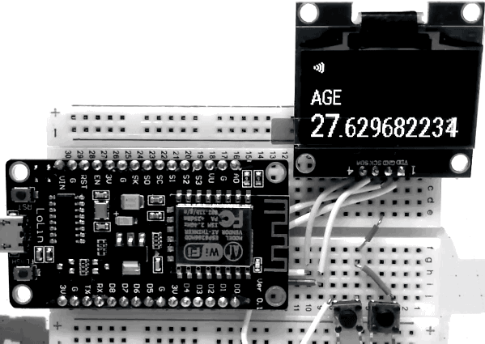

# ESP8266 Age Clock

Work in progress.  

Inspired by [Motivation](https://chrome.google.com/webstore/detail/motivation/ofdgfpchbidcgncgfpdlpclnpaemakoj)  




### Components

- Espressif ESP8266 (NodeMCU) [Aliexpress](http://s.click.aliexpress.com/e/UnqFIuF)
- 1.3" OLED 128x64 SH1106 I2C [Aliexpress](http://s.click.aliexpress.com/e/meM7iAE)

### Features (WIP)

- [+] Show Age
- [+] Connect to WiFi
- [+] Get curren time from NTP server
- [-] Configuration with web interface (WIP)
  - [-] WiFi mode (access point, client)
  - [-] Current time, time zone
  - [-] Date of birth
- [-] Persist settings in EEPROM memory
- [-] Custom PCB
- [-] Custom Case

### Prepare

Install
- [PlatformIO](http://platformio.org)
- [npm](npmjs.com)
- esptool

#### macOS

```bash
# [homebrew](brew.sh)    
brew install platformio
brew install node
brew install esptool
```

### Build

```bash
npm install
gulp
platformio run
platformio run --target buildfs
```

### Flash

```
platformio run --target upload
platformio run --target uploadfs
```

### Other

#### Flash manual

`esptool.py --port /dev/cu.wchusbserial1410 --baud 115200 write_flash --flash_size=detect -fm dio 0 .pioenvs/nodemcuv2/firmware.bin`


#### Run web app from local

`gulp connect`

#### Stack trace decode

`pbcopy > stack.txt`  
`java -jar tools/EspStackTraceDecoder.jar ~/.platformio/packages/toolchain-xtensa/bin/xtensa-lx106-elf-addr2line .pioenvs/nodemcuv2/firmware.elf stack.txt`

#### Serial

`pio device monitor --port /dev/cu.wchusbserial1410 --baud 115200`
